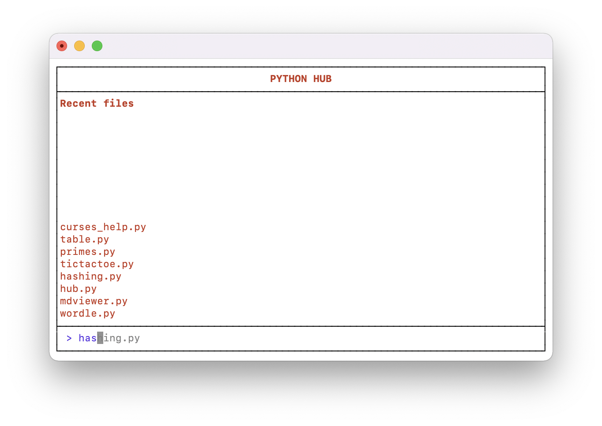

# Python Hub

`hub.py` is a python program to manage the execution of your python scripts in the console.

The reason why `hub.py` was developed is because running python scripts in the console can be very tedious. To do this, you need to navigate to the directory of your script (e.g. `cd /Users/Noxmain/Desktop/`) and run your script with `python3 script.py`.

But running your scripts with `hub.py` is __much easier__. You only have to drag your script file once into the console and it will be saved in the recently executed scripts, enabling you to run it easily using autocompletion.

## Features

- Displays your __recent files__, ordered by when you last ran them
- __Autocompletes__ recent filenames when you type them
- __Saves the paths__ to your scripts so you don't have to type them in

## How to install

Just __download__ the file `hub.py` and __save it in the root directory of your console__.

If you save it in the root directory of your console, you do not have to navigate there when you want to run the hub. (You can easily find the root directory by typing `open .` into your console.)

## How to use

If you saved `hub.py` in the root directory of your console, you only have to enter `python3 hub.py` to __run it__.

Within the hub you can select recent files using the up and down __arrow keys__ or by __entering the filename__.

To run a new file (not from the recent files), simply __drag it into your console window__ and press Enter. It will then be stored in the recent files.

To exit the hub, you can type `exit`, `quit` or simply press Enter (enter nothing).

## Notice

Please __do not use__ the escape key or special characters like `Ä` or `§`. These can cause strange behavior or crashes.

## Technical features

- Uses `cd` when running scripts, so even scripts with dependencies can be executed without problems
- Displays the runtime after running a script
- Displays an error message when an error occurs
- Saves the recent files in the `.hub` file (in the same directory) in `json` format
